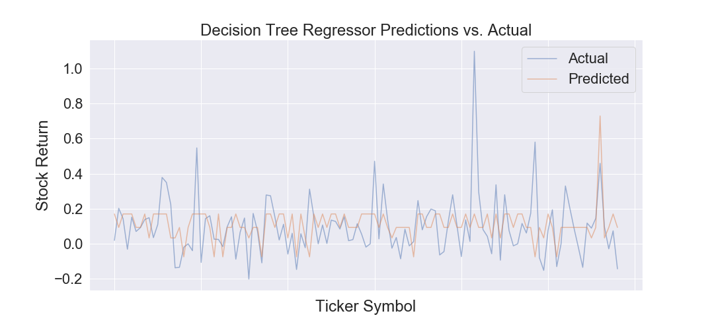
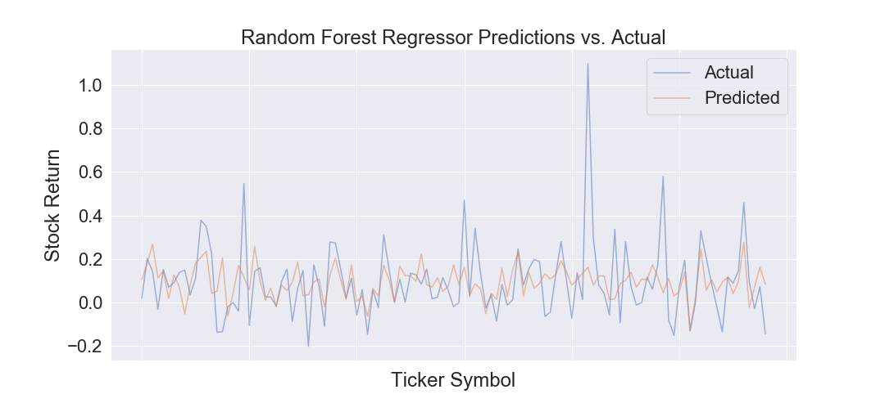

```{r setup, include=FALSE}
knitr::opts_chunk$set(echo = TRUE)
```

## **Overview**
The purpose of our research project is to be able to perform predictions on the open stock price of a company to enable investors to be more confident as to where they invest their money. Given the volatile nature of the stock market, we knew this is an extremely difficult due to a variety of factors, from environmental factors to emotional factors. Our goal is to inform people of a model that can help predict stock prices and filter out which factors are more significant than others in making these predictions. This can ultimately allow novice investors to make shrewd stock market decisions. In our given dataset, we were given 29 quantitative fundamental characteristics for a given stock market company, and wanted to further analyze those specific characteristics to make predictions for future stock prices. Specifically, we want to answer the question: Do company financials and fundamental characteristics correlate with future prices of stock?

The dataset that we are working with is one that we found from <https://www.kaggle.com/dgawlik/nyse/version/3#_=_>. The person who scraped the data fetched the prices from Yahoo Finance and grabbed the fundamental columns from Nasdaq Financials and some of those columns were extended using fields from the EDGAR SEC databases. The data of interest was seperated into two datasets, one that contained the quantitative fundamental characteristics for a given company on a given day and another that contained the opening stock prices for a given company on a given day. The data was merged via a self-implemented ID column. 

<br>

*Abbreviated sample of our cleaned dataset*

<div style="width:500px; height:200px">

</div>

<br>

## **Discovering Correlation**

<br>

<div style="width:500px; height:300px">
#####**Correlationship Map for All Fundamentals**

</div>


<br>
<br>
<br>
<br>
<br>
<br>
<br>
<br>
<br>


From the fundamental dataset we were given, we wanted to know which fundamental variables potentially correlate to opening stock price (stock price at the beginning of a given day for a given company) and the strength of each fundamental individually. Above is a heatmap to indicate the amount of strength in correlation each fundamental variable has with one another.


<br>

<div style="width:500px; height:300px">
#####**Correlationship Rankings For All Fundamentals to Open Prices**


</div>

<br>
<br>
<br>
<br>
<br>
<br>
<br>
<br>
<br>
<br>
<br>
<br>
<br>
<br>

Since opening price is the variable under analysis, above is a more concise visualization that hones in on the strength of correlation between opening price and the fundamental variables.

<br>

## **Multivariate Regression**
We are trying to predict the opening prices based off of fundamental characteristics. Knowing this, the variable we are predicting is a non-negative integer, which indicates we are looking to make count predictions. Therefore we chose to perform multivariate regression on our dataset and see how much variation of the open stock price can be explained by the fundamentals.


*Abbreviated sample of our OLS Regression Results*
<div style="width:500px; height:22s0px">

</div>

<br>

###**Forward Selection**
To not overfit the model, we must account for variables that have a statistically non-significant relations with our outcome variable.
We defined a formula for forward selection. The formula is an "optimal" fitted statsmodels polynomial linear model with an intercept selected by forward selection evaluated by adjusted R-squared.

The resulting "best fit" model is now reduced to 13 fundamental variables, and the predictions are plotted below:


<br>

## **Machine Learning Models**

### K Neighbors
Our first model used was the K Nearest Neighbors Classifier. K Nearest Neighbors uses the closest N neighbors in order to make predictions on a data set. Because of the somewhat linear nature of our data set, we believe looking at neighbors will be an effective way to make predictions. We identified two hyper parameters to tune, n_neighbors and the weight to be used.


### Decision Tree
The second model used was Decision Tree Regression. Because our dataset is not wholly linear, contrary to K Neighbors, using a nonparametric method is appropriate to account for any nonlinear structure in the underlying distribution.


### Random Forest
Similar to the K Nearest Neighbors Classifier, the Random Forest Classifier can also be considered a weighted neighbor model. It differs from the Random Forest model because it creates multiple decision trees, which then uses the mean of those individual trees.


### Kernel Ridge
Our final model uses ridge regression. This model is especially good at preventing multicollinearity from affecting the outcome of the model. We felt this was an appropriate model to use due to the close nature many of the filtered fundamentals share. 
