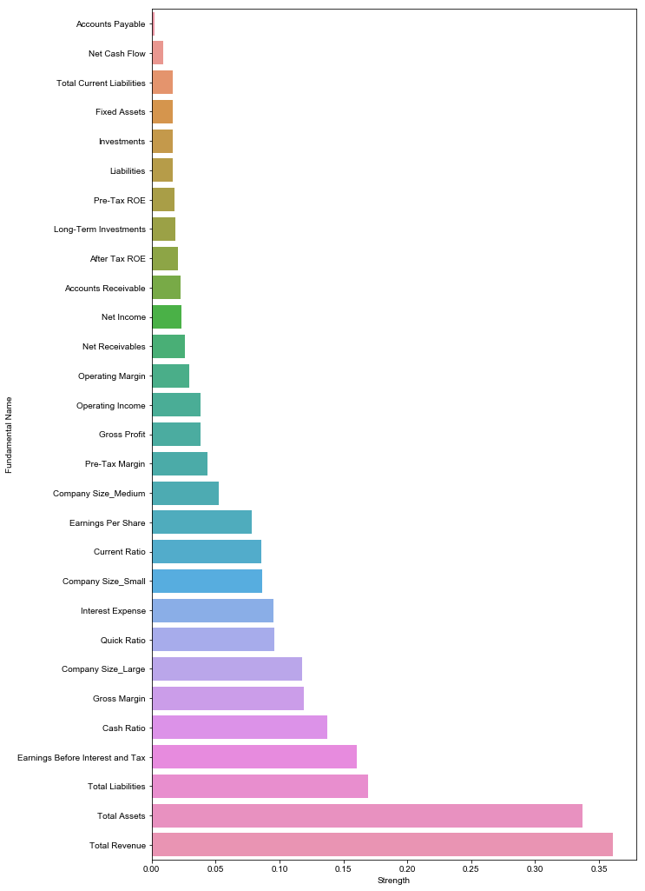
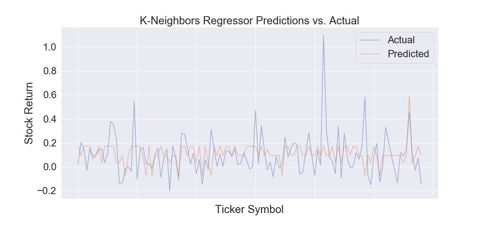

```{r setup, include=FALSE}
knitr::opts_chunk$set(echo = TRUE)
```

## **Overview**
The purpose of our research project is to be able to perform predictions on the open stock price of a company to enable investors to be more confident as to where they invest their money. Given the volatile nature of stock market fluctuation, we know this is an extremely difficult due to a variety of factors. Our goal is to inform people of a model that can help predict stock prices and filter out which factors are more significant than others in making these predictions. This can ultimately allow novice investors or experienced executives to make shrewd stock market decisions. In our given dataset, we were given 29 quantitative fundamental characteristics for a given stock market company, and wanted to further analyze those specific characteristics to make predictions for future stock prices. Specifically, we want to answer the question: Do company financials and fundamental characteristics correlate with future prices of stock?

The dataset that we are working with is one that we found from <https://www.kaggle.com/dgawlik/nyse/version/3#_=_>. The person who scraped the data fetched the prices from Yahoo Finance and grabbed the fundamental columns from Nasdaq Financials and some of those columns were extended using fields from the EDGAR SEC databases. The data of interest was separated into two datasets, one that contained the quantitative fundamental characteristics for a given company on a given day and another that contained the opening stock prices for a given company on a given day. The data was merged via a self-implemented ID column. 

<br>

*Abbreviated sample of our cleaned dataset*

<div style="width:500px; height:200px">

</div>

<br>

## **Discovering Correlation**

<br>

<div style="width:500px; height:300px">
#####**Correlationship Map for All Fundamentals**

</div>


<br>
<br>
<br>
<br>
<br>
<br>
<br>
<br>
<br>


From the fundamental dataset we were given, we wanted to know which fundamental variables potentially correlate to opening stock price and the strength of each fundamental individually. Above is a heatmap to indicate the amount of strength in correlation each fundamental variable has with one another.

<br>

<div style="width:500px; height:300px">
#####**Correlationship Rankings For All Fundamentals to Open Prices**


</div>

<br>
<br>
<br>
<br>
<br>
<br>
<br>
<br>
<br>
<br>
<br>
<br>
<br>
<br>

Since opening price is the variable under analysis, above is a more concise visualization that hones in on the strength of correlation between opening price and the fundamental variables.

## **Multivariate Regression**


## **Machine Learning Models**

### K Neighbors


### Decision Tree


### Random Forest


### Kernel Ridge


